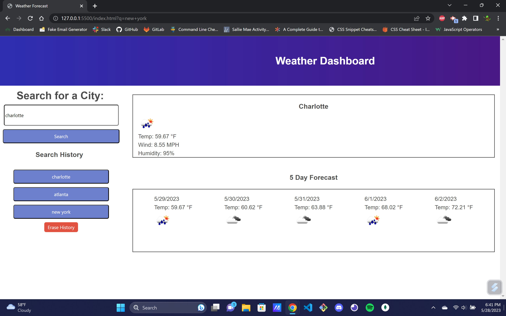

# weather-app
a weather app using APIs

are you constantly traveling and need weather updates? look no further, this weather app is designed to find the weather in any city around the world. Are you American and have no idea what you're looking at when your weather channel in your hotel room says 45°C? Should you be wearing shorts or pants? what about long sleeves? Not to worry, every temperature metric is converted to fahrenheit!

This was my first time doing a solo project with APIs and using Bulma, so it started to be a challenge. I will update in the future to add local storage to remember past city searches and will fix the 5 day forecast to display the correct results.

live site can be found at https://github.com/PhilRug/weather-app

search bar code was found with https://pagedart.com/blog/how-to-add-a-search-bar-in-html/

weather icon code was from https://stackoverflow.com/questions/44177417/how-to-display-openweathermap-weather-icon